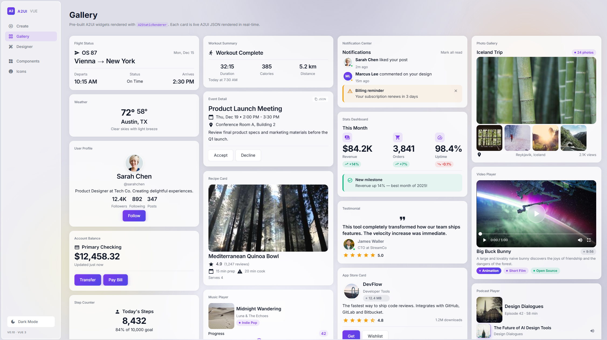
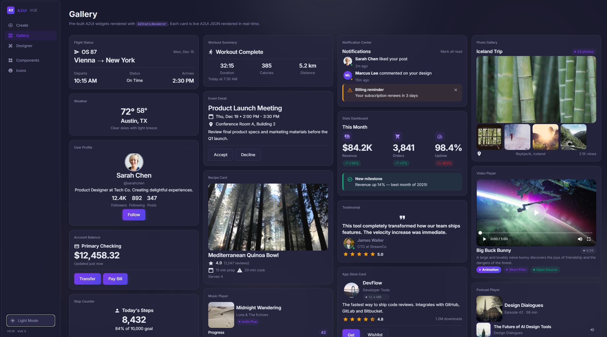
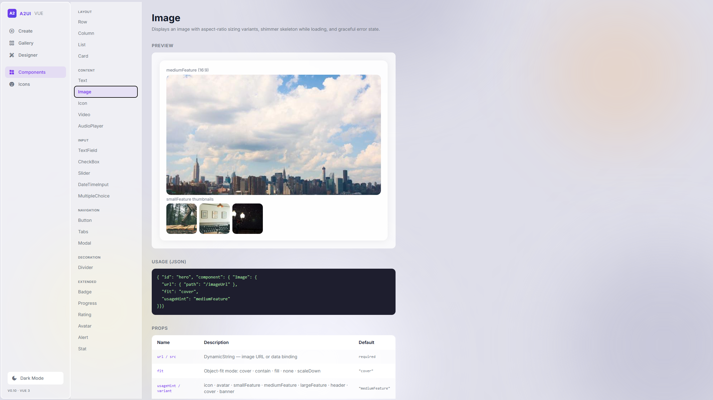
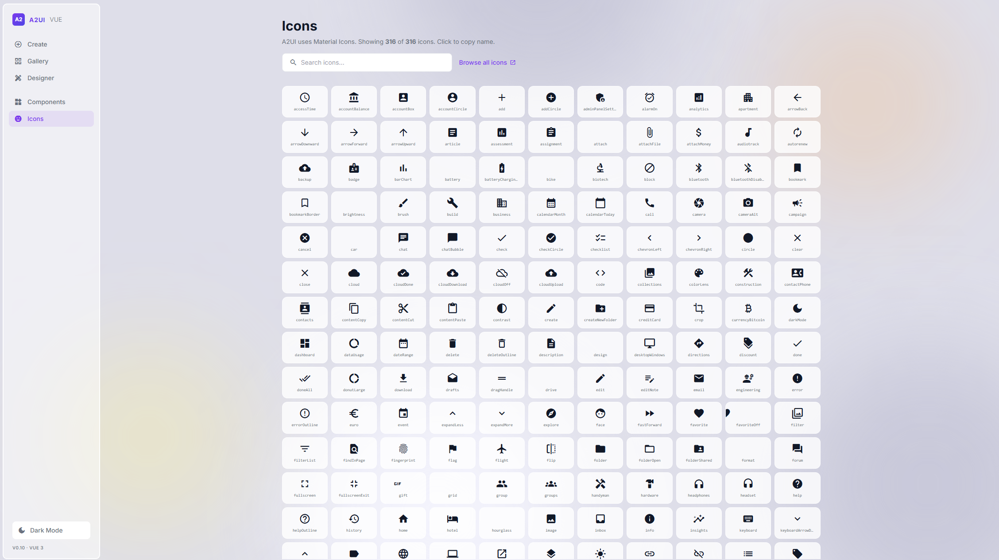
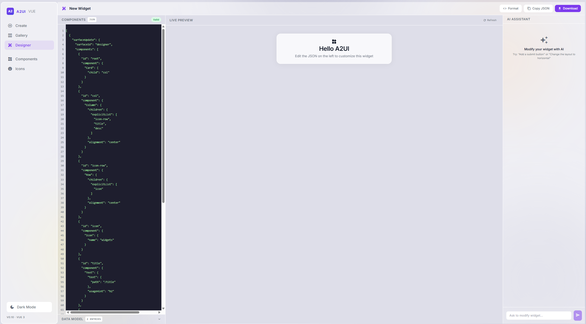

<p align="center">
  <strong style="font-size:2rem">A2 <span style="color:#7c3aed">UI</span> Vue</strong>
</p>

<h1 align="center">A2UI Vue</h1>

<p align="center">
  A Vue 3 renderer and composer for the <a href="https://google.github.io/A2UI/">Google A2UI protocol</a> — stream structured UI from AI agents to your Vue/Nuxt app in real time.
</p>

<p align="center">
  <a href="https://www.npmjs.com/package/@vkdevfolio/a2ui-vue"></a>
  <a href="https://vuejs.org/"></a>
  <a href="LICENSE"></a>
  <a href="CONTRIBUTING.md"></a>
</p>

<p align="center">
  <a href="#-quick-start">Quick Start</a> ·
  <a href="#-components">Components</a> ·
  <a href="#-protocol">Protocol</a> ·
  <a href="#-examples">Examples</a> ·
  <a href="CONTRIBUTING.md">Contributing</a>
</p>

---

## What is A2UI?

[Google's A2UI protocol](https://google.github.io/A2UI/) lets AI agents stream rich, interactive UI to a frontend application — without the frontend knowing anything about the AI. The agent produces structured JSON describing a widget tree; the renderer turns it into real Vue components.

**A2UI Vue** is the first open-source Vue 3 implementation of this protocol. It ships:

- 🎨 **`<A2StaticRenderer>`** — render any A2UI JSON without an agent (perfect for galleries and prototyping)
- ⚡ **`<A2Surface>`** — live SSE connection to an A2UI-speaking agent; components stream in and update reactively
- 🧩 **24 components** — layout, content, input, navigation — all Apple-quality polished
- 🌗 **Dark & light mode** — seamless CSS-variable-based theming
- 🔌 **LLM-agnostic** — works with OpenAI, Anthropic, Gemini — any backend that speaks A2UI

---

## Screenshots

### Gallery — Light Mode



### Gallery — Dark Mode



### Component Reference



### Icons Browser (316 Material Icons)



### AI Designer — JSON Editor + Live Preview



> **Add screenshots:** Drop PNG/JPG files into `docs/screenshots/` with the names above, or replace the paths with your own hosted image URLs.

---

## ✨ Features

| Feature                    | Details                                                                                                                                                                                              |
| -------------------------- | ---------------------------------------------------------------------------------------------------------------------------------------------------------------------------------------------------- |
| **A2UI v0.8 + v0.10**      | Supports both protocol versions simultaneously                                                                                                                                                       |
| **Streaming SSE**          | Components render and update token-by-token as the agent streams                                                                                                                                     |
| **Reactive data model**    | JSON Pointer paths (`/user/name`) bind live to any component                                                                                                                                         |
| **Static rendering**       | `<A2StaticRenderer>` for galleries, demos, and testing                                                                                                                                               |
| **24 components**          | Row, Column, List, Card, Tabs, Modal, Text, Image, Icon, Video, AudioPlayer, Badge, Progress, Rating, Avatar, Alert, Stat, TextField, CheckBox, ChoicePicker, Slider, DateTimeInput, Button, Divider |
| **Custom media players**   | Full custom video and audio player UIs (no browser defaults)                                                                                                                                         |
| **Glassmorphism**          | `backdrop-filter: blur()` cards, modals, and overlays                                                                                                                                                |
| **316 Material Icons**     | Searchable icon browser built-in                                                                                                                                                                     |
| **Python backend example** | FastAPI + LangGraph + multi-LLM factory                                                                                                                                                              |

---

## 🚀 Quick Start

### 1. Install

```bash
npm install @vkdevfolio/a2ui-vue
# or
pnpm add @vkdevfolio/a2ui-vue
```

### 2. Register the plugin

```ts
// main.ts
import { createApp } from 'vue'
import { A2UIPlugin } from '@vkdevfolio/a2ui-vue'
import '@vkdevfolio/a2ui-vue/style.css'
import App from './App.vue'

createApp(App)
  .use(A2UIPlugin)
  .mount('#app')
```

### 3. Render a static widget

```vue
<template>
  <A2StaticRenderer :components="widgetJson" />
</template>

<script setup>
import { A2StaticRenderer } from '@vkdevfolio/a2ui-vue'

const widgetJson = [
  {
    id: 'root',
    component: {
      Card: { child: 'col', padding: 20 }
    }
  },
  {
    id: 'col',
    component: {
      Column: {
        children: { explicitList: ['title', 'body'] }
      }
    }
  },
  {
    id: 'title',
    component: { Text: { text: 'Hello A2UI!', variant: 'h2' } }
  },
  {
    id: 'body',
    component: { Text: { text: 'Rendered from JSON in Vue 3.' } }
  }
]
</script>
```

### 4. Connect to a live agent

```vue
<template>
  <A2Surface agent-url="http://localhost:8000/a2ui" />
</template>

<script setup>
import { A2Surface } from '@vkdevfolio/a2ui-vue'
</script>
```

---

## 🧩 Components

### Layout

| Component | Description                                            |
| --------- | ------------------------------------------------------ |
| `Row`     | Horizontal flex container with alignment/distribution  |
| `Column`  | Vertical flex container                                |
| `List`    | Repeating list with template children                  |
| `Card`    | Glassmorphic card with optional background color       |
| `Tabs`    | Tab bar with sliding indicator                         |
| `Modal`   | Overlay dialog with blur backdrop and spring animation |
| `Divider` | Horizontal or vertical separator                       |

### Content

| Component     | Description                                                                                                                        |
| ------------- | ---------------------------------------------------------------------------------------------------------------------------------- |
| `Text`        | Typography scale: h1–h5, body, caption, label + inline markdown                                                                    |
| `Image`       | Lazy-loading image with shimmer skeleton; variants: avatar, icon, smallFeature, mediumFeature, largeFeature, header, cover, banner |
| `Icon`        | Material Icons by name with size and color props                                                                                   |
| `Video`       | Full custom HTML5 video player: seek bar, buffered track, volume, fullscreen, auto-hide controls                                   |
| `AudioPlayer` | Custom audio player: spinning cover disc, ±10s skip, progress bar, volume popup                                                    |
| `Badge`       | Pill label — success / warning / error / info / neutral                                                                            |
| `Progress`    | Animated linear or circular progress bar                                                                                           |
| `Rating`      | Interactive star rating (0–5) with half stars                                                                                      |
| `Avatar`      | Image or initials avatar with status dot                                                                                           |
| `Alert`       | Severity-colored alert — info / success / warning / error; dismissible                                                             |
| `Stat`        | Large stat value + label + trend direction badge                                                                                   |

### Input

| Component       | Description                                                        |
| --------------- | ------------------------------------------------------------------ |
| `TextField`     | Floating-label text / number / password / textarea with focus ring |
| `CheckBox`      | Custom animated checkbox with gradient fill                        |
| `ChoicePicker`  | Chips, radio, or checkbox picker with optional search              |
| `Slider`        | Custom range slider with value tooltip                             |
| `DateTimeInput` | Date / time / datetime picker with floating label                  |

### Navigation

| Component | Description                                                                |
| --------- | -------------------------------------------------------------------------- |
| `Button`  | Primary (gradient), default (border), or borderless — with press animation |

---

## 📡 Protocol

A2UI Vue supports both **v0.8** and **v0.10** of the A2UI protocol simultaneously.

### Server → Client messages

| v0.10              | v0.8              | Description                              |
| ------------------ | ----------------- | ---------------------------------------- |
| `createSurface`    | `beginRendering`  | Start a new widget surface               |
| `updateComponents` | `surfaceUpdate`   | Add/update component definitions         |
| `updateDataModel`  | `dataModelUpdate` | Update reactive data bound to components |
| `deleteSurface`    | —                 | Remove a surface                         |

### Dynamic values

Components accept static strings or dynamic references:

```json
{ "text": "Hello" }
{ "text": { "path": "/user/name" } }
{ "text": { "literalString": "World" } }
```

### Actions

User interactions post back to the agent:

```json
{
  "action": "button-click",
  "surfaceId": "my-surface",
  "componentId": "submit-btn",
  "payload": {}
}
```

---

## 🐳 Docker Compose (Quickest Start)

Run both the frontend and backend with a single command:

```bash
# Add your API key
cp example-python/.env.example example-python/.env
# Edit .env with your key

# Start everything
docker compose up --build
```

- **Frontend:** http://localhost:3009
- **Backend:** http://localhost:8006

```bash
# Stop
docker compose down
```

---

## 🐍 Python Backend Example

The `example-python/` directory contains a FastAPI + LangGraph backend:

- **Multi-LLM factory** — switch between OpenAI, Anthropic, and Gemini via `LLM_PROVIDER` env var
- **Designer sub-agent** — generates valid A2UI JSON from natural language descriptions
- **Built-in tools** — weather card, user profile, task manager, login form, stats dashboard

```bash
cd example-python
pip install -r requirements.txt
cp .env.example .env   # add your API key
python server.py
```

```env
LLM_PROVIDER=openai   # openai | anthropic | google
OPENAI_API_KEY=sk-...
# ANTHROPIC_API_KEY=sk-ant-...
# GOOGLE_API_KEY=...
```

---

## 🖥️ Nuxt Example App

The `example-nuxt/` directory is a full Composer experience:

| Page           | Description                                                  |
| -------------- | ------------------------------------------------------------ |
| **Create**     | Describe a widget in chat — the agent streams it live        |
| **Gallery**    | 20+ pre-built widgets rendered from static A2UI JSON         |
| **Designer**   | JSON editor + live preview + AI assistant                    |
| **Components** | Full component reference with props tables and live previews |
| **Icons**      | Searchable grid of 316 Material Icons                        |

```bash
cd example-nuxt
pnpm install
pnpm dev
# open http://localhost:3000
```

> **Note:** Requires Node.js 18+. The `dev` script includes `--max-old-space-size=4096` for larger builds.

---

## 🏗️ Repository Structure

```
a2ui-vue/
├── src/                    # NPM package source
│   ├── components/
│   │   ├── layout/         # Row, Column, List, Card, Tabs, Modal, Divider
│   │   ├── content/        # Text, Image, Icon, Video, AudioPlayer, Badge…
│   │   ├── input/          # TextField, CheckBox, ChoicePicker, Slider…
│   │   └── navigation/     # Button
│   ├── composables/        # useA2UI, useSurface, useDataModel
│   ├── protocol/           # SSE parser + action emitter
│   ├── functions/          # Built-in validation & formatting functions
│   └── theme/              # CSS variable tokens (dark/light)
├── example-nuxt/           # Nuxt 3 Composer app
├── example-python/         # FastAPI + LangGraph backend
└── docs/                   # Documentation assets & screenshots
```

---

## 🎨 Theming

All components use CSS custom properties. Override in your app:

```css
:root {
  --a2ui-primary: #7c3aed;
  --a2ui-bg-surface: #ffffff;
  --a2ui-text: #111113;
  --a2ui-card-bg: rgba(255, 255, 255, 0.72);
  --a2ui-card-border: rgba(0, 0, 0, 0.08);
}

.dark {
  --a2ui-bg-surface: #14141f;
  --a2ui-text: #e8e8f0;
  --a2ui-card-bg: rgba(37, 37, 64, 0.8);
}
```

---

## 🤝 Contributing

Contributions are very welcome! This project is in active development.

### Ways to contribute

- 🐛 **Bug reports** — open an issue with reproduction steps
- 💡 **Feature requests** — describe your use case in an issue
- 🧩 **New components** — follow the component pattern in `src/components/`
- 📝 **Documentation** — improve examples, fix typos, add usage notes
- 🔌 **Backend integrations** — add TypeScript/Node.js, Go, or other backends
- 🎨 **Gallery widgets** — add new pre-built widget examples

### Development setup

```bash
# Clone
git clone https://github.com/your-org/a2ui-vue.git
cd a2ui-vue

# Install + build package
pnpm install
pnpm build

# Run example app
cd example-nuxt
pnpm install
pnpm dev
```

### Adding a component

1. Create `src/components/<category>/A2YourComponent.vue`
2. Register in `src/components/A2Renderer.vue`
3. Export from `src/index.ts`
4. Add a TypeScript interface in `src/types.ts`
5. Add a preview in `example-nuxt/pages/components.vue`

See [CONTRIBUTING.md](CONTRIBUTING.md) for the full guide, code style, and PR checklist.

---

## 📄 License

MIT — see [LICENSE](LICENSE) for details.

---

## 🙏 Acknowledgements

- [Google A2UI](https://google.github.io/A2UI/) — the protocol
- [CopilotKit](https://copilotkit.ai/) — inspiration from their React A2UI Composer
- [Material Icons](https://fonts.google.com/icons) — icon set
- [Big Buck Bunny](https://peach.blender.org/) — Blender Foundation (CC), used in demos

---

<p align="center">Built with ❤️ &nbsp;·&nbsp; <a href="https://github.com/your-org/a2ui-vue/stargazers">Star it if you find it useful ⭐</a></p>